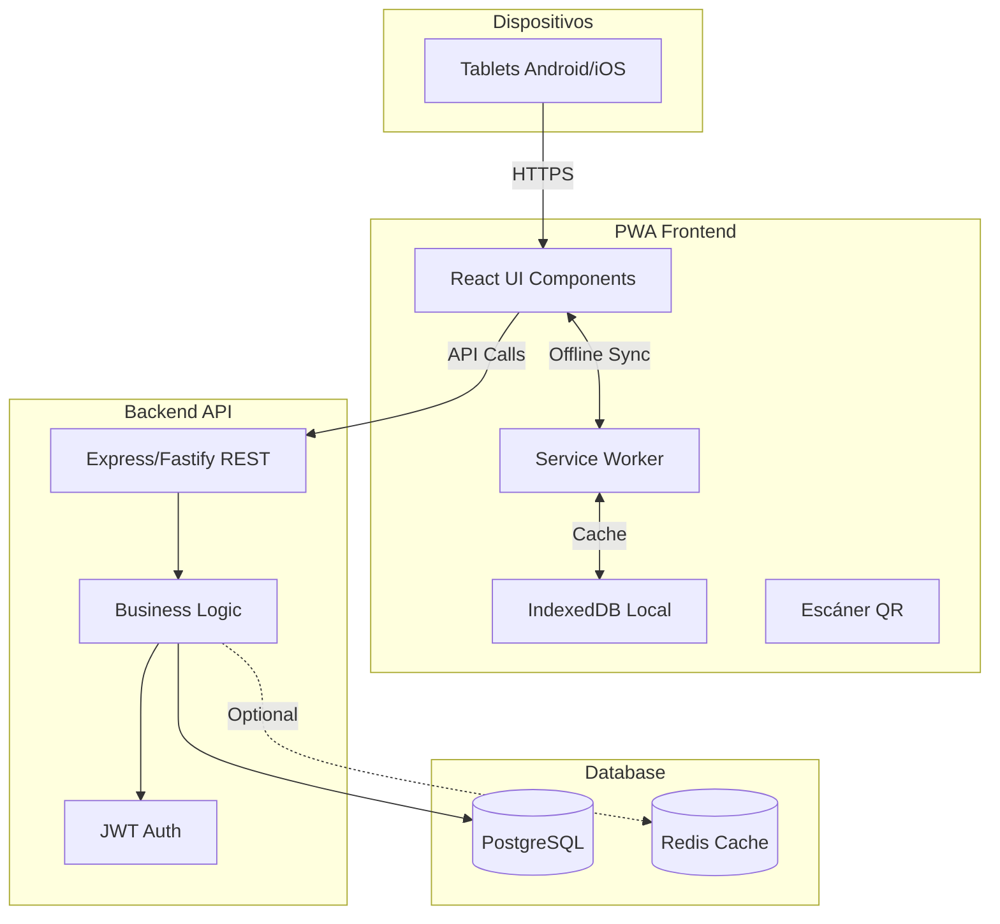
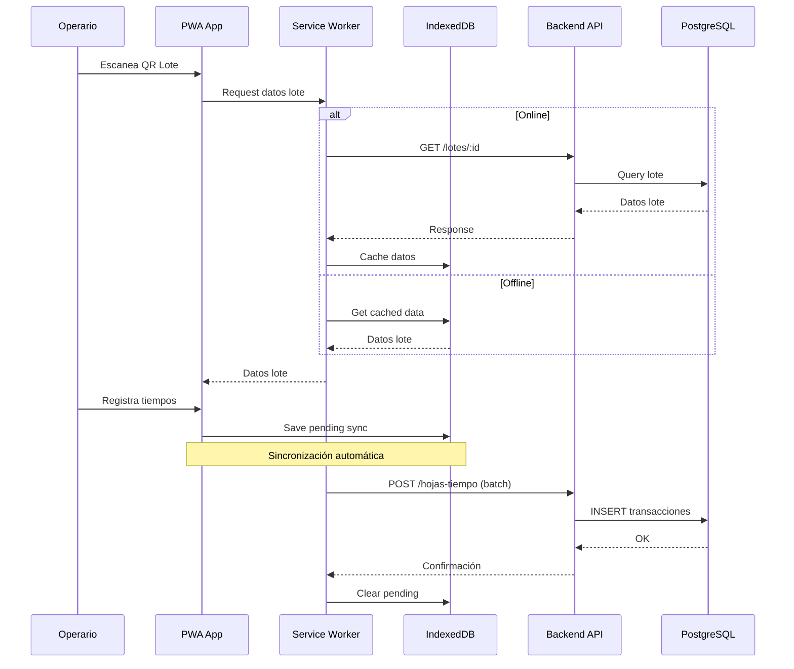

# Propuesta de Stack Tecnológico - App Web Profesional

## Recomendación: Progressive Web App (PWA) con React + TypeScript

### Justificación Técnica

Basándome en los requisitos analizados, recomiendo una **PWA (Progressive Web App)** en lugar de app nativa por:

1. **Facilidad de uso y capacitación**: Una sola URL, sin instalación desde tiendas
2. **Mantenimiento simplificado**: Un solo código para tablets Android/iOS
3. **Actualizaciones instantáneas**: Sin esperar aprobaciones de tiendas
4. **Offline-first nativo**: Service Workers + IndexedDB para sincronización
5. **Costo-beneficio**: 40% menos tiempo de desarrollo vs React Native

## Stack Tecnológico Propuesto

### Frontend (PWA)

```
React 18 + TypeScript + Vite
├── UI Framework: shadcn/ui + Tailwind CSS
├── Estado: Zustand (simple y performante)
├── Offline: Workbox (Service Workers)
├── DB Local: Dexie.js (IndexedDB wrapper)
├── Escaneo QR: html5-qrcode
├── Firma Digital: react-signature-canvas
└── PWA: vite-plugin-pwa
```

**Ventajas para operarios**:

- Interfaz táctil optimizada (botones grandes, gestos intuitivos)
- Modo oscuro/claro según iluminación de planta
- Feedback visual inmediato (loading, confirmaciones)
- Funciona sin internet, sincroniza automáticamente

### Backend (API REST)

```
Node.js + Express + TypeScript
├── Validación: Zod
├── ORM: Prisma (type-safe, migraciones automáticas)
├── Autenticación: JWT + refresh tokens
├── Rate Limiting: express-rate-limit
├── Logging: Winston + Morgan
└── Testing: Jest + Supertest
```

**Alternativa recomendada**: **Fastify** (20% más rápido que Express, ideal para 50 tx/s)

### Base de Datos

```
PostgreSQL 15+
├── Extensiones: pg_stat_statements (monitoreo)
├── Índices optimizados para consultas frecuentes
├── Particionamiento por fecha (DETALLE_TIEMPOS)
└── Backup automático diario
```

**Por qué PostgreSQL**:

- Maneja 50 tx/s sin problemas
- JSON nativo para datos de auditoría
- Transacciones ACID (crítico para ALCOA+)
- Gratuito y maduro

### Infraestructura

```
Docker + Docker Compose
├── Contenedor Frontend (Nginx)
├── Contenedor Backend (Node.js)
├── Contenedor DB (PostgreSQL)
└── Contenedor Redis (caché opcional)
```

## Arquitectura Actualizada



## Flujo Offline-First



## Estructura de Proyecto

```
pharmadix-app/
├── frontend/                 # PWA React
│   ├── src/
│   │   ├── components/      # UI components
│   │   │   ├── operario/   # Pantallas operario
│   │   │   └── admin/      # Pantallas supervisor
│   │   ├── services/       # API calls
│   │   ├── stores/         # Zustand stores
│   │   ├── workers/        # Service Workers
│   │   └── db/             # IndexedDB schemas
│   ├── public/
│   │   └── manifest.json   # PWA manifest
│   └── vite.config.ts
│
├── backend/                 # API Node.js
│   ├── src/
│   │   ├── routes/         # Express routes
│   │   ├── controllers/    # Business logic
│   │   ├── services/       # DB operations
│   │   ├── middlewares/    # Auth, validation
│   │   └── prisma/         # Prisma schema
│   └── tests/
│
├── docker-compose.yml       # Orquestación
└── docs/                    # Documentación actualizada
```

## Ventajas para Operarios (UX/UI)

### Diseño Simplificado

1. **Pantalla de inicio**: 3 botones grandes

   - "Nueva Hoja" (verde, 60% pantalla)
   - "Mis Hojas" (azul)
   - "Sincronizar" (gris)

2. **Escaneo QR**: Cámara full-screen con guías visuales

   - Feedback sonoro al escanear
   - Vibración de confirmación

3. **Captura de tiempos**: Lista visual de trabajadores

   - Avatar + nombre grande
   - Botón "Entrada" / "Salida" con color
   - Hora actual visible siempre

4. **Firma digital**: Canvas táctil optimizado

   - Botón "Limpiar" grande
   - Confirmación visual antes de enviar

### Accesibilidad

- Textos mínimo 16px (legibles sin lentes)
- Contraste WCAG AA