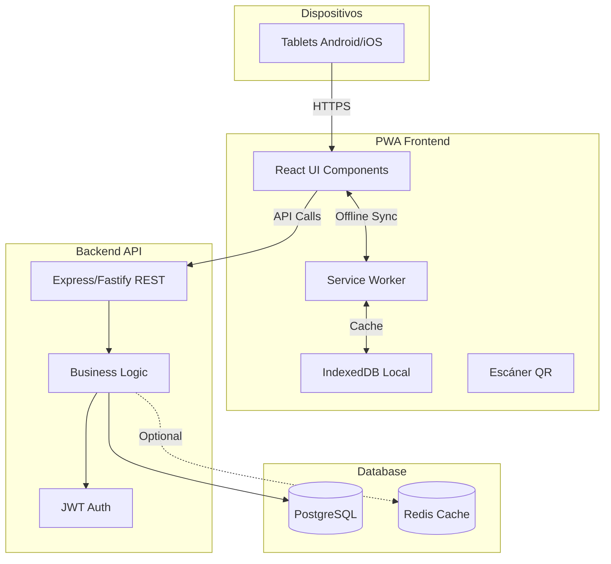
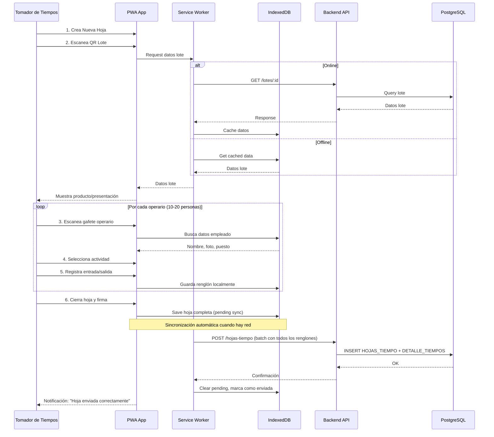

# Propuesta de Stack Tecnológico - App Web Profesional

## Recomendación: Progressive Web App (PWA) con React + TypeScript

### Justificación Técnica

Basándome en los requisitos analizados, recomiendo una **PWA (Progressive Web App)** en lugar de app nativa por:

1. **Facilidad de uso y capacitación**: Una sola URL, sin instalación desde tiendas
2. **Mantenimiento simplificado**: Un solo código para tablets Android/iOS
3. **Actualizaciones instantáneas**: Sin esperar aprobaciones de tiendas
4. **Offline-first nativo**: Service Workers + IndexedDB para sincronización
5. **Costo-beneficio**: 40% menos tiempo de desarrollo vs React Native

## Stack Tecnológico Propuesto

### Frontend (PWA)

```
React 18 + TypeScript + Vite
├── UI Framework: shadcn/ui + Tailwind CSS
├── Estado: Zustand (simple y performante)
├── Offline: Workbox (Service Workers)
├── DB Local: Dexie.js (IndexedDB wrapper)
├── Escaneo QR: html5-qrcode
├── Firma Digital: react-signature-canvas
└── PWA: vite-plugin-pwa
```

**Ventajas para Tomador de Tiempos**:

- Interfaz táctil optimizada (botones grandes, gestos intuitivos)
- Flujo guiado paso a paso (evita errores)
- Búsqueda rápida de operarios (por nombre o gafete)
- Registro masivo eficiente (10-20 operarios por hoja)
- Modo oscuro/claro según iluminación de planta
- Feedback visual inmediato (loading, confirmaciones)
- Funciona sin internet, sincroniza automáticamente
- Contador de progreso ("5 de 10 operarios registrados")

### Backend (API REST)

```
Node.js + Express + TypeScript
├── Validación: Zod
├── ORM: Prisma (type-safe, migraciones automáticas)
├── Autenticación: JWT + refresh tokens
├── Rate Limiting: express-rate-limit
├── Logging: Winston + Morgan
└── Testing: Jest + Supertest
```

**Alternativa recomendada**: **Fastify** (20% más rápido que Express, ideal para 50 tx/s)

### Base de Datos

```
PostgreSQL 15+
├── Extensiones: pg_stat_statements (monitoreo)
├── Índices optimizados para consultas frecuentes
├── Particionamiento por fecha (DETALLE_TIEMPOS)
└── Backup automático diario
```

**Por qué PostgreSQL**:

- Maneja 50 tx/s sin problemas
- JSON nativo para datos de auditoría
- Transacciones ACID (crítico para ALCOA+)
- Gratuito y maduro

### Infraestructura

```
Docker + Docker Compose
├── Contenedor Frontend (Nginx)
├── Contenedor Backend (Node.js)
├── Contenedor DB (PostgreSQL)
└── Contenedor Redis (caché opcional)
```

## Arquitectura Actualizada



## Flujo Completo: Tomador de Tiempos registra múltiples operarios



## Estructura de Proyecto

```
pharmadix-app/
├── frontend/                      # PWA React
│   ├── src/
│   │   ├── components/           # UI components
│   │   │   ├── tomador/         # Pantallas Tomador de Tiempos
│   │   │   │   ├── CrearHoja.tsx
│   │   │   │   ├── EscanearLote.tsx
│   │   │   │   ├── RegistrarOperarios.tsx  # Lista de operarios
│   │   │   │   ├── TarjetaOperario.tsx     # Card individual
│   │   │   │   ├── FirmaDigital.tsx
│   │   │   │   └── MisHojas.tsx
│   │   │   └── admin/           # Pantallas supervisor
│   │   │       ├── Dashboard.tsx
│   │   │       ├── Reportes.tsx
│   │   │       └── Aprobaciones.tsx
│   │   ├── services/            # API calls
│   │   │   ├── lotes.service.ts
│   │   │   ├── empleados.service.ts
│   │   │   └── hojas.service.ts
│   │   ├── stores/              # Zustand stores
│   │   │   ├── hojaStore.ts     # Estado de hoja actual
│   │   │   └── syncStore.ts     # Estado de sincronización
│   │   ├── workers/             # Service Workers
│   │   │   └── sync.worker.ts
│   │   └── db/                  # IndexedDB schemas
│   │       ├── schema.ts
│   │       └── sync.ts
│   ├── public/
│   │   └── manifest.json        # PWA manifest
│   └── vite.config.ts
│
├── backend/                      # API Node.js
│   ├── src/
│   │   ├── routes/              # Express routes
│   │   │   ├── lotes.routes.ts
│   │   │   ├── empleados.routes.ts
│   │   │   └── hojas.routes.ts
│   │   ├── controllers/         # Business logic
│   │   ├── services/            # DB operations
│   │   ├── middlewares/         # Auth, validation
│   │   └── prisma/              # Prisma schema
│   └── tests/
│
├── docker-compose.yml            # Orquestación
└── docs/                         # Documentación actualizada
```

## Ventajas para Tomador de Tiempos (UX/UI)

### Flujo de Trabajo Optimizado

**ROL CLAVE**: El **Tomador de Tiempos** registra los horarios de **múltiples operarios** (ej: 10-20 personas por hoja). No es auto-registro.

### Diseño Simplificado

1. **Pantalla de inicio**: 3 botones grandes

                                                                                                                                                                                                                                                                                                                                                                                                                                                                                                                                                                                                                                                                                                                                                                                                                                                                                                                                                                                                                                                                                                                                                                                                                                                                                                                                                                                                                                                                                                                                                                                                - "Nueva Hoja" (verde, 60% pantalla)
                                                                                                                                                                                                                                                                                                                                                                                                                                                                                                                                                                                                                                                                                                                                                                                                                                                                                                                                                                                                                                                                                                                                                                                                                                                                                                                                                                                                                                                                                                                                                                                                - "Mis Hojas" (azul)
                                                                                                                                                                                                                                                                                                                                                                                                                                                                                                                                                                                                                                                                                                                                                                                                                                                                                                                                                                                                                                                                                                                                                                                                                                                                                                                                                                                                                                                                                                                                                                                                - "Sincronizar" (gris)

2. **Crear Hoja**: Flujo guiado paso a paso

                                                                                                                                                                                                                                                                                                                                                                                                                                                                                                                                                                                                                                                                                                                                                                                                                                                                                                                                                                                                                                                                                                                                                                                                                                                                                                                                                                                                                                                                                                                                                                                                - **Paso 1**: Escanear QR del Lote (cámara full-screen)
                                                                                                                                                                                                                                                                                                                                                                                                                                                                                                                                                                                                                                                                                                                                                                                                                                                                                                                                                                                                                                                                                                                                                                                                                                                                                                                                                                                                                                                                                                                                                                                                - **Paso 2**: Confirmar datos del lote (producto, presentación)
                                                                                                                                                                                                                                                                                                                                                                                                                                                                                                                                                                                                                                                                                                                                                                                                                                                                                                                                                                                                                                                                                                                                                                                                                                                                                                                                                                                                                                                                                                                                                                                                - **Paso 3**: Seleccionar turno (Mañana/Tarde/Noche)
                                                                                                                                                                                                                                                                                                                                                                                                                                                                                                                                                                                                                                                                                                                                                                                                                                                                                                                                                                                                                                                                                                                                                                                                                                                                                                                                                                                                                                                                                                                                                                                                - Feedback sonoro y vibración en cada paso

3. **Captura de tiempos**: Interfaz tipo "lista de asistencia"

                                                                                                                                                                                                                                                                                                                                                                                                                                                                                                                                                                                                                                                                                                                                                                                                                                                                                                                                                                                                                                                                                                                                                                                                                                                                                                                                                                                                                                                                                                                                                                                                - **Búsqueda rápida**: Campo de búsqueda por nombre/gafete
                                                                                                                                                                                                                                                                                                                                                                                                                                                                                                                                                                                                                                                                                                                                                                                                                                                                                                                                                                                                                                                                                                                                                                                                                                                                                                                                                                                                                                                                                                                                                                                                - **Escaneo gafete**: Botón grande "Escanear Gafete" (cámara QR)
                                                                                                                                                                                                                                                                                                                                                                                                                                                                                                                                                                                                                                                                                                                                                                                                                                                                                                                                                                                                                                                                                                                                                                                                                                                                                                                                                                                                                                                                                                                                                                                                - **Tarjeta de operario**: 
                                                                                                                                                                                                                                                                                                                                                                                                                                                                                                                                                                                                                                                                                                                                                                                                                                                                                                                                                                                                                                                                                                                                                                                                                                                                                                                                                                                                                                                                                                                                                                                                                                                                                                                                                                                                                                                                                                                                                                                                                                                                                                                                                                                                                                                                                                                                                                                                                                                                                                                                                                                                                                                                - Foto + Nombre + Gafete (grande, legible)
                                                                                                                                                                                                                                                                                                                                                                                                                                                                                                                                                                                                                                                                                                                                                                                                                                                                                                                                                                                                                                                                                                                                                                                                                                                                                                                                                                                                                                                                                                                                                                                                                                                                                                                                                                                                                                                                                                                                                                                                                                                                                                                                                                                                                                                                                                                                                                                                                                                                                                                                                                                                                                                                - Selector de actividad (dropdown táctil)
                                                                                                                                                                                                                                                                                                                                                                                                                                                                                                                                                                                                                                                                                                                                                                                                                                                                                                                                                                                                                                                                                                                                                                                                                                                                                                                                                                                                                                                                                                                                                                                                                                                                                                                                                                                                                                                                                                                                                                                                                                                                                                                                                                                                                                                                                                                                                                                                                                                                                                                                                                                                                                                                - Botones "Entrada" / "Salida" (verde/rojo, 80px altura)
                                                                                                                                                                                                                                                                                                                                                                                                                                                                                                                                                                                                                                                                                                                                                                                                                                                                                                                                                                                                                                                                                                                                                                                                                                                                                                                                                                                                                                                                                                                                                                                                                                                                                                                                                                                                                                                                                                                                                                                                                                                                                                                                                                                                                                                                                                                                                                                                                                                                                                                                                                                                                                                                - Hora actual visible siempre
                                                                                                                                                                                                                                                                                                                                                                                                                                                                                                                                                                                                                                                                                                                                                                                                                                                                                                                                                                                                                                                                                                                                                                                                                                                                                                                                                                                                                                                                                                                                                                                                - **Agregar otro**: Botón flotante "+" para siguiente operario
                                                                                                                                                                                                                                                                                                                                                                                                                                                                                                                                                                                                                                                                                                                                                                                                                                                                                                                                                                                                                                                                                                                                                                                                                                                                                                                                                                                                                                                                                                                                                                                                - **Contador**: "5 de 10 operarios registrados" (progreso visual)

4. **Revisión y cierre**:

                                                                                                                                                                                                                                                                                                                                                                                                                                                                                                                                                                                                                                                                                                                                                                                                                                                                                                                                                                                                                                                                                                                                                                                                                                                                                                                                                                                                                                                                                                                                                                                                - Lista resumen de todos los operarios registrados
                                                                                                                                                                                                                                                                                                                                                                                                                                                                                                                                                                                                                                                                                                                                                                                                                                                                                                                                                                                                                                                                                                                                                                                                                                                                                                                                                                                                                                                                                                                                                                                                - Editar/eliminar renglones
                                                                                                                                                                                                                                                                                                                                                                                                                                                                                                                                                                                                                                                                                                                                                                                                                                                                                                                                                                                                                                                                                                                                                                                                                                                                                                                                                                                                                                                                                                                                                                                                - Botón "Cerrar Hoja" (requiere confirmación)

5. **Firma digital**: Canvas táctil optimizado

                                                                                                                                                                                                                                                                                                                                                                                                                                                                                                                                                                                                                                                                                                                                                                                                                                                                                                                                                                                                                                                                                                                                                                                                                                                                                                                                                                                                                                                                                                                                                                                                - Botón "Limpiar" grande
                                                                                                                                                                                                                                                                                                                                                                                                                                                                                                                                                                                                                                                                                                                                                                                                                                                                                                                                                                                                                                                                                                                                                                                                                                                                                                                                                                                                                                                                                                                                                                                                - Confirmación visual antes de enviar
                                                                                                                                                                                                                                                                                                                                                                                                                                                                                                                                                                                                                                                                                                                                                                                                                                                                                                                                                                                                                                                                                                                                                                                                                                                                                                                                                                                                                                                                                                                                                                                                - Mensaje: "Hoja enviada correctamente" con checkmark

### Accesibilidad

- Textos mínimo 16px (legibles sin lentes)
- Contraste WCAG AAA
- Botones mínimo 48x48px (táctil)
- Iconos + texto (no solo iconos)
- Modo alto contraste para ambientes con poca luz

## Migración de Documentación

### Archivos a actualizar

1. **[Arquitectura y Diseño Tecnico (1).pdf](Documentacion_Realizada/Arquitectura y Diseño Tecnico (1).pdf)**

                                                                                                                                                                                                                                                                                                                                                                                                                                                                                                                                                                                                                                                                                                                                                                                                                                                                                                                                                                                                                                                                                                                                                                                                                                                                                                                                                                                                                                                                                                                                                                                                - Sección 3: Stack Tecnológico → Agregar detalles de React, Node.js, PostgreSQL
                                                                                                                                                                                                                                                                                                                                                                                                                                                                                                                                                                                                                                                                                                                                                                                                                                                                                                                                                                                                                                                                                                                                                                                                                                                                                                                                                                                                                                                                                                                                                                                                - Diagrama de arquitectura → Actualizar con PWA + Service Workers
                                                                                                                                                                                                                                                                                                                                                                                                                                                                                                                                                                                                                                                                                                                                                                                                                                                                                                                                                                                                                                                                                                                                                                                                                                                                                                                                                                                                                                                                                                                                                                                                - Tabla de tecnologías → Especificar versiones y librerías

2. **[Flujo_Procesos_Pharmadix.md](Documentacion_Realizada/Flujo_Procesos_Pharmadix.md)**

                                                                                                                                                                                                                                                                                                                                                                                                                                                                                                                                                                                                                                                                                                                                                                                                                                                                                                                                                                                                                                                                                                                                                                                                                                                                                                                                                                                                                                                                                                                                                                                                - Cambiar "App Móvil" por "PWA (Progressive Web App)"
                                                                                                                                                                                                                                                                                                                                                                                                                                                                                                                                                                                                                                                                                                                                                                                                                                                                                                                                                                                                                                                                                                                                                                                                                                                                                                                                                                                                                                                                                                                                                                                                - Actualizar diagramas de secuencia con Service Workers
                                                                                                                                                                                                                                                                                                                                                                                                                                                                                                                                                                                                                                                                                                                                                                                                                                                                                                                                                                                                                                                                                                                                                                                                                                                                                                                                                                                                                                                                                                                                                                                                - Agregar flujo de sincronización offline

3. **[Informe Ejecutivo_ Digitalización de Tiempos Pharmadix.pdf](Documentacion_Realizada/Informe Ejecutivo_ Digitalización de Tiempos Pharmadix.pdf)**

                                                                                                                                                                                                                                                                                                                                                                                                                                                                                                                                                                                                                                                                                                                                                                                                                                                                                                                                                                                                                                                                                                                                                                                                                                                                                                                                                                                                                                                                                                                                                                                                - Sección de tecnología → Justificar PWA vs nativa
                                                                                                                                                                                                                                                                                                                                                                                                                                                                                                                                                                                                                                                                                                                                                                                                                                                                                                                                                                                                                                                                                                                                                                                                                                                                                                                                                                                                                                                                                                                                                                                                - Costos → Actualizar estimaciones (PWA reduce 40% tiempo)
                                                                                                                                                                                                                                                                                                                                                                                                                                                                                                                                                                                                                                                                                                                                                                                                                                                                                                                                                                                                                                                                                                                                                                                                                                                                                                                                                                                                                                                                                                                                                                                                - Riesgos → Mitigar "Resistencia al cambio" con UX simplificada

### Nuevo archivo: Stack_Tecnologico_v2.md

Crear documento detallado con:

- Justificación de cada tecnología
- Comparativa PWA vs React Native vs Nativa
- Guías de desarrollo para equipo
- Configuración de ambientes (dev, staging, prod)

## Historial de Cambios (CHANGELOG.md)

```markdown
# Changelog - Sistema de Gestión de Tiempos Pharmadix

## [2.0.0] - 2026-01-27

### Changed - Stack Tecnológico

#### Frontend
- **ANTES**: App móvil nativa (sin especificar tecnología)
- **AHORA**: Progressive Web App (PWA)
 - React 18 + TypeScript
 - shadcn/ui + Tailwind CSS
 - Workbox para offline-first
 - Dexie.js para almacenamiento local

**Razón**: Simplificar mantenimiento, mejorar UX para operarios, reducir costos de desarrollo.

#### Backend
- **ANTES**: API Backend (sin especificar tecnología)
- **AHORA**: Node.js + Express/Fastify + TypeScript
 - Prisma ORM
 - JWT para autenticación
 - Winston para logging

**Razón**: Ecosistema maduro, type-safety, rendimiento para 50 tx/s.

#### Base de Datos
- **ANTES**: Base de datos relacional (sin especificar motor)
- **AHORA**: PostgreSQL 15+
 - Extensiones para auditoría
 - Particionamiento por fecha
 - Índices optimizados

**Razón**: Cumplimiento ALCOA+, escalabilidad, gratuito.

### Added
- Service Workers para sincronización offline
- IndexedDB para caché local de datos
- Docker Compose para despliegue
- Modo oscuro/claro adaptativo
- Feedback táctil (vibración) en escaneos

### Improved
- UX simplificada: botones grandes, menos clics
- Rendimiento: caché inteligente, lazy loading
- Accesibilidad: WCAG AAA, textos legibles
- Capacitación: URL única, sin instalación

## [1.0.0] - 2026-01-15

### Initial
- Diseño de base de datos relacional
- Flujo de procesos AS-IS y TO-BE
- Requisitos funcionales y no funcionales
```

## Comparativa: PWA vs React Native

| Criterio | PWA (Recomendado) | React Native |

|----------|-------------------|--------------|

| **Instalación** | URL, sin tiendas | App Store/Play Store |

| **Actualizaciones** | Instantáneas | Aprobación tiendas (días) |

| **Offline** | Service Workers nativos | Requiere librerías extra |

| **Mantenimiento** | 1 código base | 1 código, 2 builds |

| **Escaneo QR** | html5-qrcode (cámara) | react-native-camera |

| **Costo desarrollo** | 3 meses | 4-5 meses |

| **Curva aprendizaje** | Baja (web estándar) | Media (APIs nativas) |

| **Rendimiento** | 95% nativo | 98% nativo |

**Conclusión**: Para tablets con WiFi estable y operarios poco técnicos, PWA es superior.

## Próximos Pasos

1. Crear documento `Stack_Tecnologico_v2.md` con especificaciones completas
2. Actualizar diagramas en `Flujo_Procesos_Pharmadix.md`
3. Crear `CHANGELOG.md` con historial de cambios
4. Generar archivo de configuración `docker-compose.yml` de ejemplo
5. Documentar guías de desarrollo en `docs/DEVELOPMENT.md`

## Riesgos Mitigados

| Riesgo Original | Mitigación con PWA |

|-----------------|-------------------|

| Resistencia al cambio | UX simplificada, capacitación in-situ con URL |

| Falla de conectividad | Service Workers + IndexedDB, sincronización automática |

| Errores de captura | Validaciones en tiempo real, escaneo QR |

| Mantenimiento costoso | Stack moderno, Docker, actualizaciones sin tiendas |

---

**Nota**: Esta propuesta mantiene 100% de los requisitos funcionales y mejora significativamente la experiencia de usuario, mantenibilidad y costos operativos.