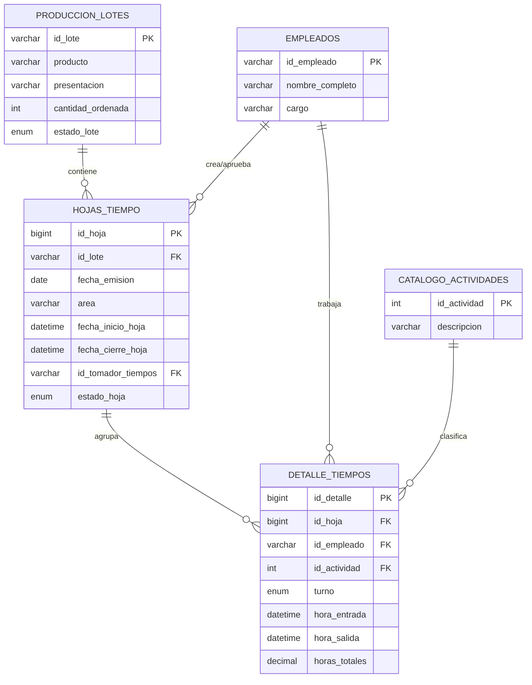

# Ejemplos de Extracción de Requisitos y Diseño de BD

Este documento muestra ejemplos reales de cómo aplicar la skill usando el proyecto Pharmadix como caso de estudio.

## Ejemplo 1: Extracción desde Documento de Arquitectura

### Fuente
Documento: "Arquitectura y Diseño Técnico v2 - Sistema de Gestión de Tiempos Pharmadix"

### Requisitos Funcionales Extraídos

#### RF-001: Creación de Hoja Digital de Tiempo
- **Descripción**: El sistema debe permitir al Tomador de Tiempos crear una nueva hoja digital escaneando el código QR del lote
- **Actor**: Tomador de Tiempos
- **Prioridad**: Must Have
- **Flujo**:
  1. Operario escanea QR del lote
  2. App solicita datos del lote al backend
  3. Sistema genera ID consecutivo automático para la hoja
  4. Se crea registro en estado BORRADOR
- **Criterios de Aceptación**:
  - [ ] El ID de hoja es auto-incremental y único
  - [ ] Se vincula automáticamente al lote escaneado
  - [ ] Se registra fecha/hora de creación
  - [ ] Se asigna el tomador de tiempos actual

#### RF-002: Registro de Tiempos por Trabajador
- **Descripción**: El sistema debe permitir registrar múltiples trabajadores en una misma hoja con sus actividades y horarios
- **Actor**: Tomador de Tiempos
- **Prioridad**: Must Have
- **Flujo**:
  1. Por cada trabajador, escanear gafete
  2. Seleccionar actividad del catálogo
  3. Registrar hora de entrada/salida
  4. Sistema calcula horas totales automáticamente
- **Criterios de Aceptación**:
  - [ ] Permite múltiples renglones por hoja
  - [ ] Calcula `horas_totales = hora_salida - hora_entrada`
  - [ ] Valida que el empleado exista en el catálogo
  - [ ] Valida que la actividad sea válida

#### RF-003: Cierre y Firma de Hoja
- **Descripción**: El sistema debe permitir cerrar y firmar digitalmente una hoja completa
- **Actor**: Tomador de Tiempos, Jefe de Manufactura
- **Prioridad**: Must Have
- **Flujo**:
  1. Tomador revisa la hoja completa
  2. Aplica firma digital
  3. Sistema envía hoja al backend
  4. Backend inserta en HOJAS_TIEMPO y DETALLE_TIEMPOS
  5. Cambia estado a ENVIADA
- **Criterios de Aceptación**:
  - [ ] No permite edición después de firma
  - [ ] Registra timestamp de cierre
  - [ ] Almacena ID del firmante
  - [ ] Confirma envío exitoso

### Requisitos No Funcionales Extraídos

#### RNF-001: Rendimiento
- Soportar 50 transacciones/segundo con latencia < 200ms
- Generar reportes de costos en menos de 10 segundos
- **Fuente**: Informe Ejecutivo, Sección 3 "Objetivos SMART"

#### RNF-002: Disponibilidad Offline
- Arquitectura "Offline-First"
- App debe guardar datos localmente si no hay conexión
- Sincronización automática al recuperar red
- **Fuente**: Informe Ejecutivo, Sección 4 "Gestión de Riesgos"

#### RNF-003: Auditoría (ALCOA+)
- Cumplimiento de principios ALCOA+ mediante trazas digitales
- Registro de quién, cuándo y qué se modificó
- Inmutabilidad de registros cerrados
- **Fuente**: Arquitectura Técnica, Sección 4 "Ventajas del Diseño"

#### RNF-004: Usabilidad
- Diseño UX/UI simplificado (botones grandes, pocos clics)
- Curva de aprendizaje mínima para operarios
- Réplica del proceso físico (Digital Twin)
- **Fuente**: Informe Ejecutivo, Gestión de Riesgos - Resistencia al cambio

### Diseño de Base de Datos Extraído

#### Tablas Maestras

##### PRODUCCION_LOTES
**Propósito**: Almacenar información de los lotes de producción

| Campo | Tipo | Restricciones | Descripción |
|-------|------|---------------|-------------|
| id_lote | VARCHAR(50) | PK, NOT NULL | Número de lote (ej: "L-2026-001") |
| producto | VARCHAR(200) | NOT NULL | Nombre del producto (ej: "Ivermectina 1%") |
| presentacion | VARCHAR(100) | NOT NULL | Presentación (ej: "Frasco 500ml") |
| cantidad_ordenada | INT | NOT NULL | Cantidad a producir |
| estado_lote | ENUM | 'ABIERTO', 'CERRADO' | Estado actual del lote |
| fecha_creacion | DATETIME | DEFAULT NOW() | Fecha de creación del lote |

**Índices:**
- PRIMARY KEY: `id_lote`
- INDEX: `idx_estado_lote` en `estado_lote`

##### EMPLEADOS
**Propósito**: Catálogo de empleados de la planta

| Campo | Tipo | Restricciones | Descripción |
|-------|------|---------------|-------------|
| id_empleado | VARCHAR(50) | PK, NOT NULL | Número de nómina |
| nombre_completo | VARCHAR(200) | NOT NULL | Nombre del empleado |
| cargo | VARCHAR(100) | | Puesto de trabajo |
| activo | BOOLEAN | DEFAULT TRUE | Si el empleado está activo |

**Índices:**
- PRIMARY KEY: `id_empleado`
- INDEX: `idx_nombre` en `nombre_completo`

##### CATALOGO_ACTIVIDADES
**Propósito**: Catálogo de actividades productivas

| Campo | Tipo | Restricciones | Descripción |
|-------|------|---------------|-------------|
| id_actividad | INT | PK, AUTO_INCREMENT | ID único de actividad |
| descripcion | VARCHAR(200) | NOT NULL, UNIQUE | Nombre de la actividad |
| tipo | VARCHAR(50) | | Clasificación (Productiva, Limpieza, etc.) |

**Índices:**
- PRIMARY KEY: `id_actividad`
- UNIQUE: `descripcion`

#### Tablas Transaccionales

##### HOJAS_TIEMPO
**Propósito**: Representa la "Hoja Digital" que agrupa registros de tiempo

| Campo | Tipo | Restricciones | Descripción |
|-------|------|---------------|-------------|
| id_hoja | BIGINT | PK, AUTO_INCREMENT | ID único consecutivo (ej: #10545) |
| numero_fisico_referencia | VARCHAR(50) | NULL | Número de talonario pre-impreso (opcional) |
| id_lote | VARCHAR(50) | FK, NOT NULL | Lote al que pertenece esta hoja |
| fecha_emision | DATE | NOT NULL | Fecha en la parte superior de la hoja |
| area | VARCHAR(100) | | Área de producción (ej: "Inyectables") |
| proceso | VARCHAR(100) | | Proceso específico (ej: "Llenado Aséptico") |
| fecha_inicio_hoja | DATETIME | DEFAULT NOW() | Cuándo se abrió esta hoja |
| fecha_cierre_hoja | DATETIME | NULL | Cuándo se cerró/firmó |
| id_tomador_tiempos | VARCHAR(50) | FK, NOT NULL | Quién creó la hoja |
| id_jefe_manufactura | VARCHAR(50) | FK, NULL | Quién aprobó la hoja |
| observaciones_generales | TEXT | | Comentarios generales |
| estado_hoja | ENUM | 'BORRADOR', 'ENVIADA', 'APROBADA' | Estado actual |

**Índices:**
- PRIMARY KEY: `id_hoja`
- INDEX: `idx_lote` en `id_lote`
- INDEX: `idx_estado` en `estado_hoja`
- INDEX: `idx_fecha_emision` en `fecha_emision`

**Relaciones:**
- FK: `id_lote` → `PRODUCCION_LOTES(id_lote)` ON DELETE RESTRICT
- FK: `id_tomador_tiempos` → `EMPLEADOS(id_empleado)` ON DELETE RESTRICT
- FK: `id_jefe_manufactura` → `EMPLEADOS(id_empleado)` ON DELETE RESTRICT

##### DETALLE_TIEMPOS
**Propósito**: Los renglones individuales de cada hoja (un registro por trabajador/actividad)

| Campo | Tipo | Restricciones | Descripción |
|-------|------|---------------|-------------|
| id_detalle | BIGINT | PK, AUTO_INCREMENT | ID único del registro |
| id_hoja | BIGINT | FK, NOT NULL | Hoja a la que pertenece este renglón |
| id_empleado | VARCHAR(50) | FK, NOT NULL | Operario que trabajó |
| id_actividad | INT | FK, NOT NULL | Actividad realizada |
| turno | ENUM | 'MAÑANA', 'TARDE', 'NOCHE' | Turno de trabajo |
| hora_entrada | DATETIME | NOT NULL | Hora de inicio |
| hora_salida | DATETIME | NOT NULL | Hora de fin |
| horas_totales | DECIMAL(5,2) | NOT NULL | Calculado: salida - entrada |
| cantidad_producida | INT | NULL | Unidades producidas (opcional) |

**Índices:**
- PRIMARY KEY: `id_detalle`
- INDEX: `idx_hoja` en `id_hoja`
- INDEX: `idx_empleado` en `id_empleado`
- INDEX: `idx_actividad` en `id_actividad`

**Relaciones:**
- FK: `id_hoja` → `HOJAS_TIEMPO(id_hoja)` ON DELETE CASCADE
- FK: `id_empleado` → `EMPLEADOS(id_empleado)` ON DELETE RESTRICT
- FK: `id_actividad` → `CATALOGO_ACTIVIDADES(id_actividad)` ON DELETE RESTRICT

### Diagrama Entidad-Relación



### Reglas de Negocio Extraídas

#### RN-001: Validación de Lote Activo
- **Descripción**: No permitir crear hojas ni registrar tiempos en lotes con estado CERRADO
- **Implementación**: Validación antes de INSERT en HOJAS_TIEMPO
- **Fuente**: Flujo de Procesos, Sección "Puntos de Control"

```sql
-- Trigger o validación en aplicación
IF (SELECT estado_lote FROM PRODUCCION_LOTES WHERE id_lote = NEW.id_lote) = 'CERRADO' THEN
    SIGNAL SQLSTATE '45000' SET MESSAGE_TEXT = 'No se puede registrar en un lote cerrado';
END IF;
```

#### RN-002: Cálculo Automático de Horas
- **Descripción**: El campo `horas_totales` debe calcularse automáticamente
- **Fórmula**: `horas_totales = (hora_salida - hora_entrada) en horas decimales`
- **Implementación**: Trigger BEFORE INSERT/UPDATE o cálculo en aplicación
- **Fuente**: Arquitectura Técnica, Tabla DETALLE_TIEMPOS

```sql
-- Trigger
SET NEW.horas_totales = TIMESTAMPDIFF(MINUTE, NEW.hora_entrada, NEW.hora_salida) / 60.0;
```

#### RN-003: Inmutabilidad de Hojas Cerradas
- **Descripción**: Una hoja en estado ENVIADA o APROBADA no puede modificarse
- **Implementación**: Validación antes de UPDATE
- **Fuente**: Arquitectura Técnica, Sección "Auditoría ALCOA+"

```sql
-- Trigger BEFORE UPDATE
IF OLD.estado_hoja IN ('ENVIADA', 'APROBADA') THEN
    SIGNAL SQLSTATE '45000' SET MESSAGE_TEXT = 'No se puede modificar una hoja cerrada';
END IF;
```

#### RN-004: Aprobación por Bloque
- **Descripción**: El Jefe de Manufactura aprueba la hoja completa, no renglones individuales
- **Implementación**: Actualizar estado_hoja y registrar id_jefe_manufactura
- **Fuente**: Arquitectura Técnica, Sección 4 "Ventajas"

## Ejemplo 2: Script SQL Generado

```sql
-- ============================================
-- Sistema de Gestión de Tiempos Pharmadix
-- Script DDL - Base de Datos
-- ============================================

-- Tablas Maestras
CREATE TABLE PRODUCCION_LOTES (
    id_lote VARCHAR(50) PRIMARY KEY,
    producto VARCHAR(200) NOT NULL,
    presentacion VARCHAR(100) NOT NULL,
    cantidad_ordenada INT NOT NULL,
    estado_lote ENUM('ABIERTO', 'CERRADO') DEFAULT 'ABIERTO',
    fecha_creacion DATETIME DEFAULT CURRENT_TIMESTAMP,
    INDEX idx_estado_lote (estado_lote)
) ENGINE=InnoDB DEFAULT CHARSET=utf8mb4;

CREATE TABLE EMPLEADOS (
    id_empleado VARCHAR(50) PRIMARY KEY,
    nombre_completo VARCHAR(200) NOT NULL,
    cargo VARCHAR(100),
    activo BOOLEAN DEFAULT TRUE,
    INDEX idx_nombre (nombre_completo)
) ENGINE=InnoDB DEFAULT CHARSET=utf8mb4;

CREATE TABLE CATALOGO_ACTIVIDADES (
    id_actividad INT AUTO_INCREMENT PRIMARY KEY,
    descripcion VARCHAR(200) NOT NULL UNIQUE,
    tipo VARCHAR(50)
) ENGINE=InnoDB DEFAULT CHARSET=utf8mb4;

-- Tablas Transaccionales
CREATE TABLE HOJAS_TIEMPO (
    id_hoja BIGINT AUTO_INCREMENT PRIMARY KEY,
    numero_fisico_referencia VARCHAR(50),
    id_lote VARCHAR(50) NOT NULL,
    fecha_emision DATE NOT NULL,
    area VARCHAR(100),
    proceso VARCHAR(100),
    fecha_inicio_hoja DATETIME DEFAULT CURRENT_TIMESTAMP,
    fecha_cierre_hoja DATETIME,
    id_tomador_tiempos VARCHAR(50) NOT NULL,
    id_jefe_manufactura VARCHAR(50),
    observaciones_generales TEXT,
    estado_hoja ENUM('BORRADOR', 'ENVIADA', 'APROBADA') DEFAULT 'BORRADOR',
    
    INDEX idx_lote (id_lote),
    INDEX idx_estado (estado_hoja),
    INDEX idx_fecha_emision (fecha_emision),
    
    FOREIGN KEY (id_lote) REFERENCES PRODUCCION_LOTES(id_lote)
        ON DELETE RESTRICT ON UPDATE CASCADE,
    FOREIGN KEY (id_tomador_tiempos) REFERENCES EMPLEADOS(id_empleado)
        ON DELETE RESTRICT ON UPDATE CASCADE,
    FOREIGN KEY (id_jefe_manufactura) REFERENCES EMPLEADOS(id_empleado)
        ON DELETE RESTRICT ON UPDATE CASCADE
) ENGINE=InnoDB DEFAULT CHARSET=utf8mb4;

CREATE TABLE DETALLE_TIEMPOS (
    id_detalle BIGINT AUTO_INCREMENT PRIMARY KEY,
    id_hoja BIGINT NOT NULL,
    id_empleado VARCHAR(50) NOT NULL,
    id_actividad INT NOT NULL,
    turno ENUM('MAÑANA', 'TARDE', 'NOCHE'),
    hora_entrada DATETIME NOT NULL,
    hora_salida DATETIME NOT NULL,
    horas_totales DECIMAL(5,2) NOT NULL,
    cantidad_producida INT,
    
    INDEX idx_hoja (id_hoja),
    INDEX idx_empleado (id_empleado),
    INDEX idx_actividad (id_actividad),
    
    FOREIGN KEY (id_hoja) REFERENCES HOJAS_TIEMPO(id_hoja)
        ON DELETE CASCADE ON UPDATE CASCADE,
    FOREIGN KEY (id_empleado) REFERENCES EMPLEADOS(id_empleado)
        ON DELETE RESTRICT ON UPDATE CASCADE,
    FOREIGN KEY (id_actividad) REFERENCES CATALOGO_ACTIVIDADES(id_actividad)
        ON DELETE RESTRICT ON UPDATE CASCADE
) ENGINE=InnoDB DEFAULT CHARSET=utf8mb4;

-- Triggers para Reglas de Negocio

DELIMITER $$

-- RN-002: Cálculo automático de horas
CREATE TRIGGER trg_calcular_horas_totales
BEFORE INSERT ON DETALLE_TIEMPOS
FOR EACH ROW
BEGIN
    SET NEW.horas_totales = TIMESTAMPDIFF(MINUTE, NEW.hora_entrada, NEW.hora_salida) / 60.0;
END$$

-- RN-003: Inmutabilidad de hojas cerradas
CREATE TRIGGER trg_validar_hoja_cerrada
BEFORE UPDATE ON HOJAS_TIEMPO
FOR EACH ROW
BEGIN
    IF OLD.estado_hoja IN ('ENVIADA', 'APROBADA') AND NEW.estado_hoja != OLD.estado_hoja THEN
        SIGNAL SQLSTATE '45000'
        SET MESSAGE_TEXT = 'No se puede modificar una hoja cerrada';
    END IF;
END$$

DELIMITER ;

-- Datos de ejemplo
INSERT INTO CATALOGO_ACTIVIDADES (descripcion, tipo) VALUES
('Etiquetado', 'Productiva'),
('Envasado', 'Productiva'),
('Limpieza', 'Mantenimiento'),
('Control de Calidad', 'Inspección');
```

## Conclusión

Este ejemplo muestra cómo extraer sistemáticamente:
1. ✅ Requisitos funcionales con criterios de aceptación
2. ✅ Requisitos no funcionales con métricas específicas
3. ✅ Diseño completo de base de datos con tipos y restricciones
4. ✅ Reglas de negocio implementables
5. ✅ Scripts SQL listos para ejecutar

La clave es leer completamente la documentación, identificar patrones y estructurar la información de forma clara y accionable.
