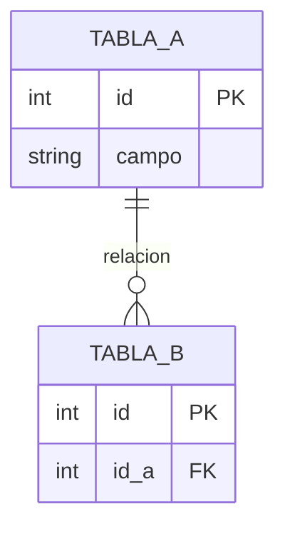

# Referencia Rápida - Extracción de Requisitos y BD

## Checklist de Extracción

### Fase 1: Preparación
- [ ] Identificar todos los documentos técnicos disponibles
- [ ] Leer completamente cada documento
- [ ] Identificar diagramas, tablas y especificaciones

### Fase 2: Requisitos Funcionales
- [ ] Buscar verbos de acción (debe, permite, registra, calcula)
- [ ] Identificar actores y casos de uso
- [ ] Extraer criterios de aceptación
- [ ] Numerar consecutivamente (RF-001, RF-002...)
- [ ] Asignar prioridad (Must/Should/Could Have)

### Fase 3: Requisitos No Funcionales
- [ ] Rendimiento (transacciones/seg, latencia, tiempo de respuesta)
- [ ] Seguridad (autenticación, autorización, auditoría)
- [ ] Disponibilidad (uptime, offline-first, sincronización)
- [ ] Escalabilidad (usuarios concurrentes, volumen de datos)
- [ ] Usabilidad (UX, accesibilidad, curva de aprendizaje)

### Fase 4: Diseño de Base de Datos
- [ ] Identificar entidades principales
- [ ] Clasificar tablas (Maestras, Transaccionales, Auditoría)
- [ ] Extraer campos con tipos de datos
- [ ] Identificar claves primarias y foráneas
- [ ] Documentar restricciones (NOT NULL, UNIQUE, etc.)
- [ ] Definir índices necesarios
- [ ] Crear diagrama ER con Mermaid

### Fase 5: Reglas de Negocio
- [ ] Validaciones de integridad
- [ ] Cálculos automáticos
- [ ] Restricciones de estado
- [ ] Flujos condicionales

### Fase 6: Documentación Final
- [ ] Generar documento estructurado
- [ ] Incluir diagramas visuales
- [ ] Agregar scripts SQL (si se solicita)
- [ ] Revisar completitud y consistencia

## Plantillas Rápidas

### Requisito Funcional
```markdown
### RF-XXX: [Nombre]
- **Descripción**: [Qué hace]
- **Actor**: [Quién]
- **Prioridad**: Must Have | Should Have | Could Have
- **Criterios de Aceptación**:
  - [ ] Criterio 1
  - [ ] Criterio 2
```

### Requisito No Funcional
```markdown
### RNF-XXX: [Categoría - Nombre]
- [Descripción con métrica específica]
- **Fuente**: [Documento origen]
```

### Tabla de Base de Datos
```markdown
#### NOMBRE_TABLA
**Propósito**: [Descripción]

| Campo | Tipo | Restricciones | Descripción |
|-------|------|---------------|-------------|
| id | PK, INT | AUTO_INCREMENT | ID único |
| campo | VARCHAR(100) | NOT NULL | Descripción |

**Índices:**
- PRIMARY KEY: `id`

**Relaciones:**
- FK: `campo_fk` → `OTRA_TABLA(id)`
```

### Regla de Negocio
```markdown
### RN-XXX: [Nombre]
- **Descripción**: [Qué valida/calcula]
- **Implementación**: [Dónde se aplica]
- **Fuente**: [Documento origen]
```

## Tipos de Datos Comunes

| Tipo SQL | Uso Común | Ejemplo |
|----------|-----------|---------|
| VARCHAR(n) | Texto variable | Nombres, descripciones |
| INT | Números enteros | IDs, cantidades |
| BIGINT | IDs grandes | IDs auto-incrementales |
| DECIMAL(p,s) | Números precisos | Precios, horas |
| DATETIME | Fecha y hora | Timestamps |
| DATE | Solo fecha | Fechas de emisión |
| ENUM | Valores fijos | Estados, tipos |
| TEXT | Texto largo | Observaciones |
| BOOLEAN | Verdadero/Falso | Flags activo/inactivo |

## Restricciones Comunes

| Restricción | Significado | Cuándo usar |
|-------------|-------------|-------------|
| PRIMARY KEY | Clave primaria | Identificador único |
| FOREIGN KEY | Clave foránea | Relación con otra tabla |
| NOT NULL | Obligatorio | Campo requerido |
| UNIQUE | Valor único | Evitar duplicados |
| DEFAULT | Valor por defecto | Valor inicial automático |
| AUTO_INCREMENT | Auto-numérico | IDs consecutivos |
| CHECK | Validación | Rango de valores |

## Índices Recomendados

Crear índices en:
- ✅ Claves primarias (automático)
- ✅ Claves foráneas (para JOINs)
- ✅ Campos de búsqueda frecuente
- ✅ Campos de filtrado (WHERE)
- ✅ Campos de ordenamiento (ORDER BY)
- ❌ Evitar en tablas pequeñas (<1000 registros)
- ❌ Evitar en campos con baja cardinalidad

## Relaciones ON DELETE/UPDATE

| Acción | Significado | Cuándo usar |
|--------|-------------|-------------|
| RESTRICT | No permite eliminar | Proteger integridad (maestros) |
| CASCADE | Elimina en cascada | Dependencias fuertes (detalles) |
| SET NULL | Establece NULL | Relación opcional |
| NO ACTION | Sin acción | Similar a RESTRICT |

## Patrones de Búsqueda en Documentos

### Para Requisitos Funcionales
- "El sistema debe..."
- "Permitir al usuario..."
- "Registrar/Calcular/Validar..."
- Diagramas de secuencia (cada paso es un RF)

### Para Requisitos No Funcionales
- Números con unidades (50 trans/seg, <200ms)
- "Cumplimiento de..." (normativas)
- "Soportar X usuarios/datos"
- "Disponibilidad del X%"

### Para Tablas de BD
- Sustantivos en mayúsculas (EMPLEADOS, LOTES)
- "Catálogo de..."
- "Registro de..."
- "INSERT/UPDATE/SELECT en..."
- Diagramas ER existentes

### Para Campos
- Parámetros de API
- Datos mencionados en flujos
- Atributos en diagramas
- Columnas en tablas de ejemplo

### Para Relaciones
- "Vincula con..."
- "Pertenece a..."
- "Contiene..."
- Flechas en diagramas

## Comandos Útiles

### Buscar documentos técnicos
```bash
# Buscar PDFs de arquitectura
**/*arquitectura*.pdf
**/*diseño*.pdf
**/*especificaciones*.pdf

# Buscar documentos Markdown
**/*requirements*.md
**/*database*.md
**/Documentacion*/**
```

### Generar diagrama Mermaid básico


## Errores Comunes a Evitar

❌ **No leer todos los documentos**: Información crítica puede estar dispersa
❌ **Inventar nombres**: Usar exactamente los nombres del documento fuente
❌ **Omitir tipos de datos**: Siempre especificar VARCHAR(n), INT, etc.
❌ **Olvidar índices**: Especialmente en FKs y campos de búsqueda
❌ **No validar FKs**: Verificar que la tabla referenciada existe
❌ **Mezclar idiomas**: Mantener consistencia (español o inglés)
❌ **No numerar requisitos**: Dificulta trazabilidad
❌ **Requisitos ambiguos**: Usar métricas específicas en RNF

## Mejores Prácticas

✅ **Lee primero, extrae después**: No empieces a escribir sin leer todo
✅ **Usa tablas Markdown**: Mejor legibilidad que texto plano
✅ **Incluye ejemplos**: Valores de ejemplo ayudan a entender
✅ **Referencia fuentes**: Indica de qué documento proviene cada dato
✅ **Valida consistencia**: Cruza referencias entre documentos
✅ **Genera diagramas**: Una imagen vale más que mil palabras
✅ **Pregunta si falta algo**: Mejor preguntar que asumir
✅ **Sugiere mejoras**: Si ves problemas de diseño, menciónalos

## Resultado Final Esperado

Un documento Markdown completo con:
1. ✅ Lista numerada de requisitos funcionales
2. ✅ Lista numerada de requisitos no funcionales
3. ✅ Especificación detallada de cada tabla
4. ✅ Diagrama ER visual con Mermaid
5. ✅ Reglas de negocio documentadas
6. ✅ Scripts SQL (opcional, si se solicita)
7. ✅ Referencias a documentos fuente
8. ✅ Trazabilidad entre requisitos y tablas

## Tiempo Estimado

- Proyecto pequeño (5-10 tablas): 30-60 minutos
- Proyecto mediano (10-20 tablas): 1-2 horas
- Proyecto grande (20+ tablas): 2-4 horas

*El tiempo incluye lectura de documentos, extracción, estructuración y validación.*
