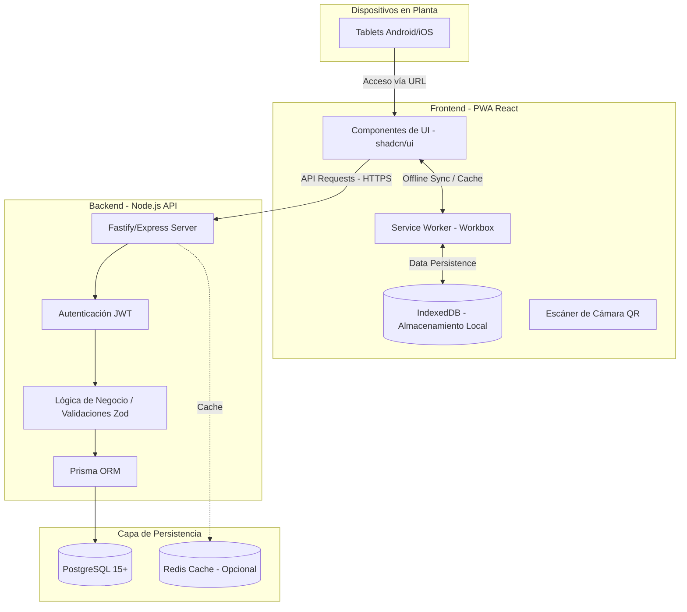

# Arquitectura y Diseño Técnico v2.0 - Pharmadix

## 1. Introducción
Este documento actualiza la arquitectura técnica original (contenida en el PDF v1) para reflejar el cambio de una aplicación móvil nativa a una **Progressive Web App (PWA)** profesional, optimizando la experiencia para el **Tomador de Tiempos** y asegurando el cumplimiento de la norma ALCOA+.

## 2. Diagrama de Arquitectura de Sistemas

## 3. Modelo de Datos (Actualización Técnica)
Se mantiene el diseño relacional original, pero se agregan campos de auditoría para trazabilidad digital:

- **HOJAS_TIEMPO:** 
    - `user_agent`: Para identificar desde qué dispositivo/navegador se cerró la hoja.
    - `ip_address`: Registro de red para auditoría.
    - `sync_at`: Marca de tiempo de cuando los datos locales se subieron al servidor.
    - `estado_aprobacion`: Enum (`BORRADOR`, `POR_APROBAR`, `APROBADA`).
    - `firma_tomador`: SVG/Base64 de la firma del tomador.
    - `firma_jefe`: SVG/Base64 de la firma del jefe de manufactura.
    - `id_jefe_aprobador`: ID del usuario que realizó la segunda confirmación.

- **DETALLE_TIEMPOS:**
    - `estado_registro`: Enum (`PENDIENTE`, `EN_PROCESO`, `FINALIZADO`).
    - `hora_entrada`: Datetime.
    - `hora_salida`: Datetime.
    - `duracion_total`: Calculado automáticamente (Salida - Entrada).
    - Tabla nueva para registrar cada acción (Login, Escaneo QR, Firma, Cierre).

## 4. Estrategia Offline-First
La aplicación prioriza el funcionamiento sin conexión constante:

1. **Carga Inicial:** El Service Worker descarga los recursos estáticos (JS, CSS, Imágenes).
2. **Sincronización de Catálogos:** Al iniciar sesión, se descargan los empleados y actividades vigentes a **IndexedDB**.
3. **Registro de Tiempos:** El Tomador de Tiempos registra operarios localmente. Los datos se guardan en el navegador.
4. **Sincronización Automática:** Al detectar conexión estable, el Service Worker envía las hojas pendientes al Backend en bloques (batch).

## 5. Diseño de Interfaz (UX) para el Tomador de Tiempos

### Captura Automática por QR de Uniforme
- **Escáner Permanente:** El botón de escaneo QR está siempre visible en la pantalla principal.
- **Identificación Instantánea:** Al escanear el código en el uniforme/gafete del operario, la app carga automáticamente:
  - Foto del empleado
  - Nombre completo
  - Puesto/Cargo
  - Número de gafete
- **Validación Visual:** El Tomador de Tiempos verifica visualmente que la foto coincide con la persona presente.

### Controles de Seguridad
- **Bloqueo de Lotes:** No se permite registrar tiempos en lotes ya cerrados en el servidor.
- **Validación de Duplicados:** El sistema alerta si un operario ya tiene registro activo en la hoja actual.

## 6. Lógica de Negocio: Máquina de Estados
Para evitar inconsistencias en el registro de tiempos, el Backend y Frontend implementan la siguiente máquina de estados por operario:

| Estado Actual | Acción Permitida | Transición a |
| :--- | :--- | :--- |
| **PENDIENTE** | Marcar Entrada | **EN_PROCESO** |
| **EN_PROCESO** | Marcar Salida | **FINALIZADO** |
| **FINALIZADO** | (Ninguna - Solo Lectura) | - |

Esto impide registrar salida sin entrada previa o duplicar registros.

---
**Documento Complementario al PDF Original**
**Fecha:** 27 de Enero, 2026
