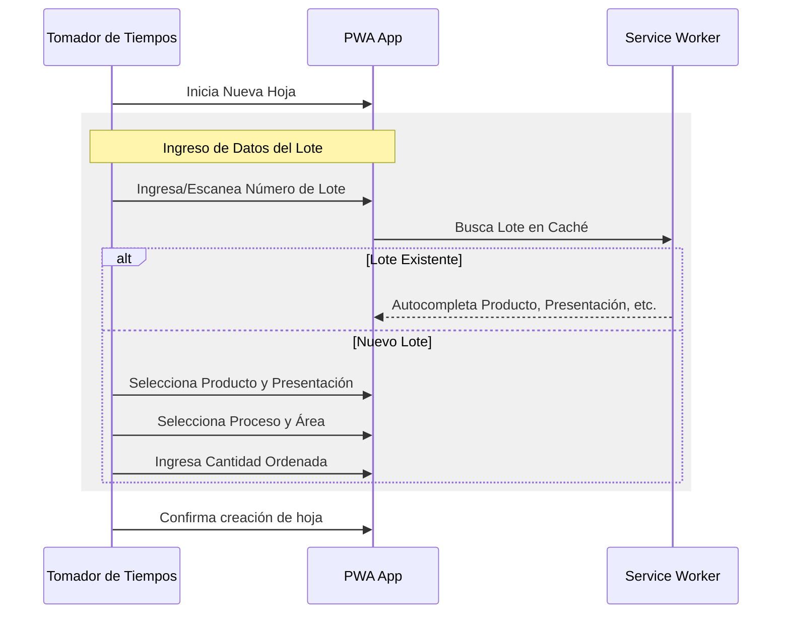
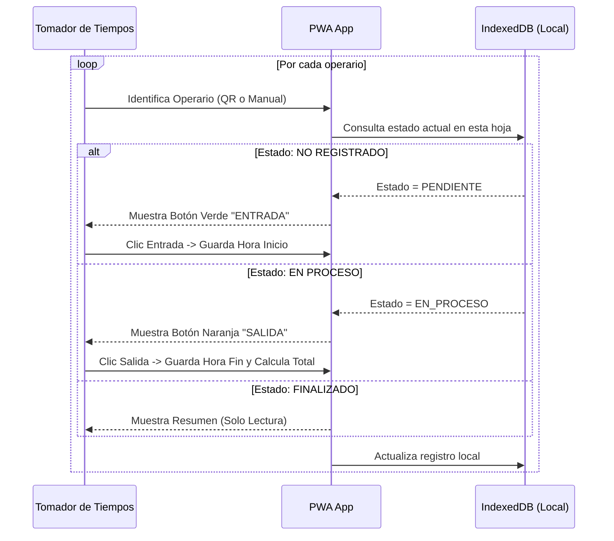
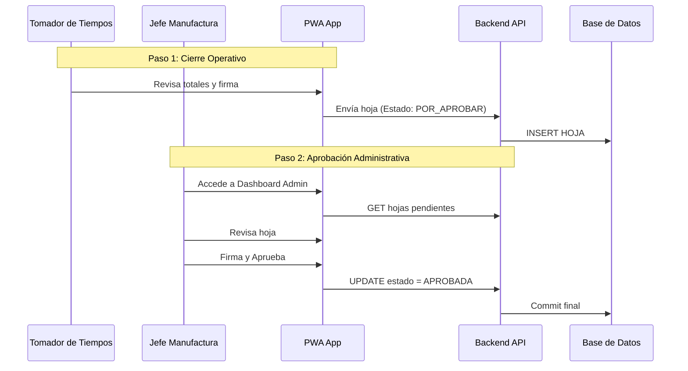
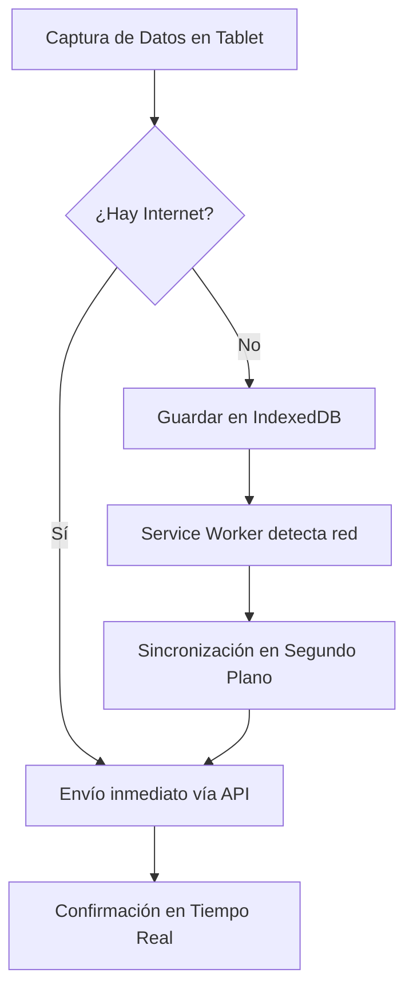

# Flujo de Procesos - Digitalización de Tiempos Pharmadix v2.0

Este documento sintetiza el flujo de procesos basado en la arquitectura **PWA (Progressive Web App)**:

- [Arquitectura y Diseño Técnico v2.0](file:///c%3A/Users/jmontero/Desktop/GitHub%20Proyectos_AGV/Pharmadix_Form_Horas_Extras/Documentacion_Realizada/Arquitectura_Diseno_Tecnico_v2.md)
- [Especificación de Stack Tecnológico v2.0](file:///c%3A/Users/jmontero/Desktop/GitHub%20Proyectos_AGV/Pharmadix_Form_Horas_Extras/Documentacion_Realizada/Stack_Tecnologico_v2.md)

## Actores y Sistemas

- **Tomador de Tiempos:** Operario encargado de registrar los tiempos de su equipo (10-20 personas).
- **PWA Frontend:** Aplicación web profesional con capacidades offline.
- **Service Worker:** Componente que gestiona la caché y sincronización en segundo plano.
- **Backend API:** API de alto rendimiento (Fastify/Node.js).
- **Base de Datos:** PostgreSQL 15+.

## Flujo TO-BE (Digital con PWA)

### 1) Inicio de Sesión e Ingreso de Lote

El Tomador de Tiempos registra los datos completos del lote.

### 2) Registro Masivo con Validación de Estado

El sistema gestiona inteligentemente si es entrada o salida.

### 3) Cierre con Doble Confirmación

Proceso de validación en dos pasos para asegurar la integridad de los datos.

## Flujo de Datos Online vs Offline

## Reportería y Auditoría ALCOA+

1. **Dashboard en Tiempo Real:** Visualización inmediata de costos y eficiencia.
2. **Trazabilidad:** Cada registro incluye sello de tiempo, ID del tomador, IP y User Agent.
3. **Integridad:** Validaciones en frontend y backend aseguran que no haya traslapes de horarios.

## Resultados Esperados v2.0

- **Cero Papel:** Eliminación total de tarjetas físicas.
- **Eficiencia en Captura:** Registro masivo optimizado para tablets.
- **Robustez:** Operación continua incluso en fallas de red.
- **Escalabilidad:** Arquitectura preparada para 50+ transacciones por segundo.
