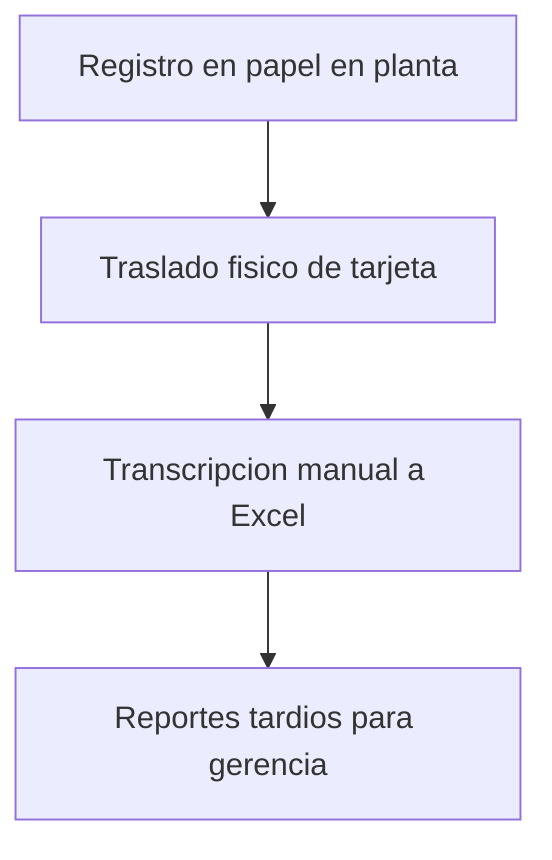
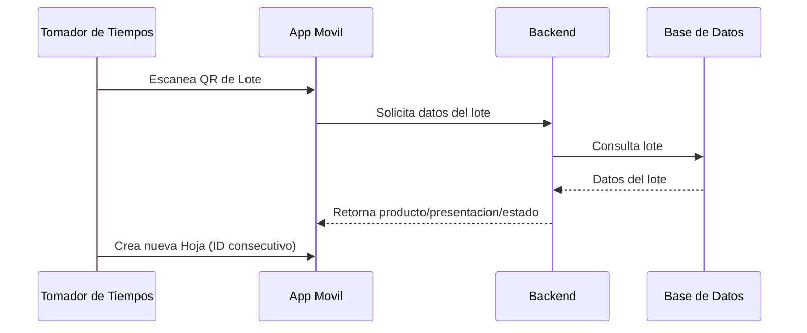
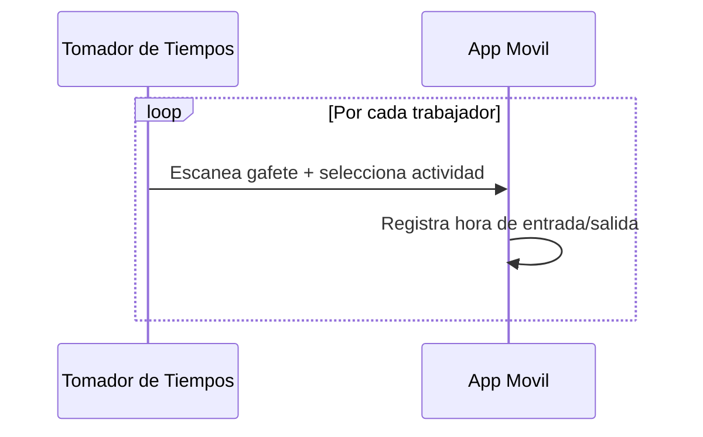
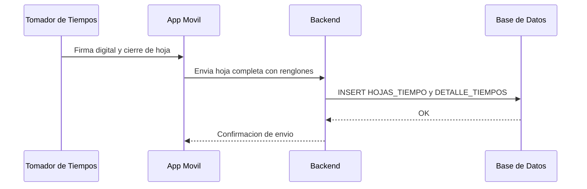
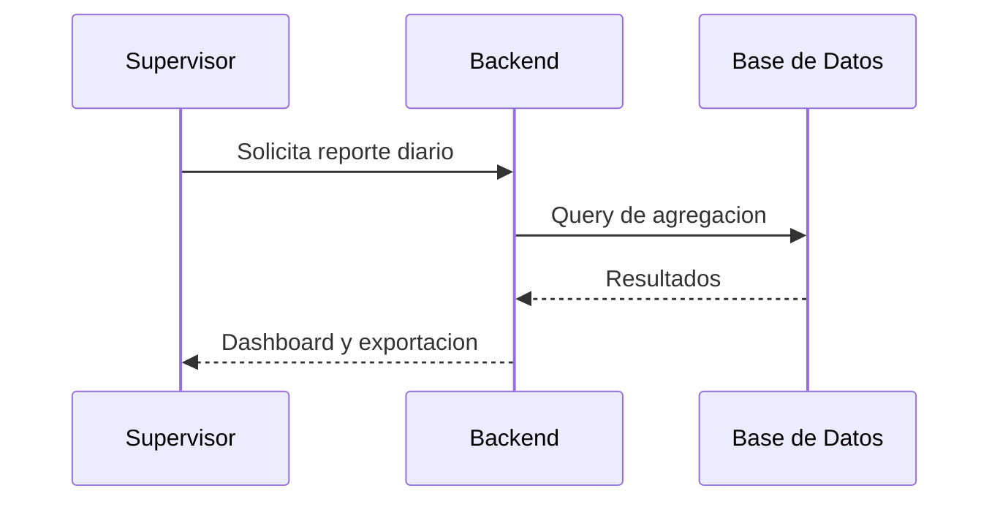

# Flujo de Procesos - Digitalizacion de Tiempos Pharmadix

Este documento sintetiza el flujo de procesos basado en:

- [Arquitectura y Diseno Tecnico v2](file:///c%3A/Users/jmontero/Desktop/GitHub%20Proyectos_AGV/Pharmadix_Form_Horas_Extras/Documentacion_Realizada/Arquitectura%20y%20Dise%C3%B1o%20Tecnico%20%281%29.pdf)
- [Informe Ejecutivo - Digitalizacion de Tiempos Pharmadix](file:///c%3A/Users/jmontero/Desktop/GitHub%20Proyectos_AGV/Pharmadix_Form_Horas_Extras/Documentacion_Realizada/Informe%20Ejecutivo_%20Digitalizaci%C3%B3n%20de%20Tiempos%20Pharmadix.pdf)

## Actores y Sistemas

- Tomador de Tiempos (operario con tablet)
- App Movil (modo offline/online)
- Backend API
- Base de Datos OLTP
- Supervisor (Web Admin)

## Flujo AS-IS (Proceso Manual)

1. Tomador de Tiempos registra en papel (Tarjeta de Distribucion de Tiempo).
2. La tarjeta se traslada fisicamente a administracion.
3. Un asistente transcribe a Excel.
4. Gerencia recibe la informacion con retraso (dias).



## Flujo TO-BE (Digital con Hoja de Tiempo)

### 1) Creacion de Hoja Digital



### 2) Llenado de la Hoja (por cada trabajador)



### 3) Cierre y Envio de Hoja



## Flujo de Datos Online vs Offline

```mermaid
arflowchart TD
    A[Escaneo QR y seleccion de actividad] --> B{Conexion disponible?}
    B -- Si --> C[POST time-entry / envio de hoja]
    C --> D[DB: INSERT tiempo]
    D --> E[Confirmacion a App]
    B -- No --> F[Guardar en DB local (pendiente)]
    F --> G[Sincronizacion batch al recuperar red]
    G --> C
```

## Reporteria y Analisis (Web Admin)

1. Supervisor solicita reporte diario o por lote.
2. API consulta agregaciones en BD (sumas por operario/lote/turno).
3. Web Admin presenta dashboards y exportaciones.



## Puntos de Control y Validaciones

- Validacion de lote activo (no permitir registrar en lote cerrado).
- Registro de auditoria por hoja y por tomador (trazabilidad ALCOA+).
- Calculo automatico de horas y horas extra al cierre.

## Resultados Esperados

- Eliminacion de la transcripcion manual.
- Datos en tiempo real y mayor integridad.
- Soporte offline-first con sincronizacion automatica.
