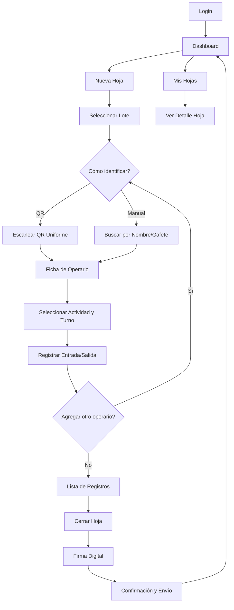

# Especificaciones para Lovable - Pharmadix Gestión de Tiempos

## 📋 Descripción del Proyecto

Aplicación web (PWA) para que los **Tomadores de Tiempos** en una planta farmacéutica registren digitalmente los horarios de múltiples operarios escaneando códigos QR de sus uniformes. Reemplaza el proceso manual en papel por captura digital con sincronización automática y funcionamiento sin internet.

---

## 👥 Usuarios

### Tomador de Tiempos (Usuario Principal)
- **Perfil:** Operario de planta con tablet, conocimiento técnico bajo-medio.
- **Tareas:** Registrar entrada/salida de 10-20 operarios por turno, escanear QR de uniformes, cerrar hojas.

### Supervisor/Admin (Usuario Secundario)
- **Perfil:** Jefe de manufactura o gerencia.
- **Tareas:** Revisar reportes, aprobar hojas, exportar datos.

---

## 🎯 Casos de Uso Principales

### CU-01: Iniciar Nueva Hoja de Trabajo (Lote Multi-Campo)
**Como** Tomador de Tiempos  
**Quiero** registrar o seleccionar un lote con todos los detalles de producción  
**Para** asegurar que los tiempos se asignen correctamente al centro de costos  

**Criterios de Aceptación:**
- **Formulario de Lote Completo:**
  - Número de Lote (Búsqueda predictiva o nuevo)
  - Producto (Autocompletado)
  - Presentación
  - Proceso (Dropdown)
  - Área de Producción (Dropdown)
  - Cantidad Ordenada (Numérico)
- Si el lote ya existe en el sistema (ingresado por otra área), carga los datos automáticamente.
- Se genera un ID de hoja único vinculado a este lote y área.

---

### CU-02: Identificar Operario (QR o Búsqueda Manual)
**Como** Tomador de Tiempos  
**Quiero** identificar al operario escaneando su QR O buscándolo manualmente  
**Para** tener flexibilidad cuando el QR esté dañado o no disponible  

**Criterios de Aceptación:**

**Opción A - Escaneo QR (Rápido):**
- Al tocar "Escanear QR", se abre la cámara en pantalla completa.
- Al detectar el QR del uniforme, se cierra la cámara y aparece una tarjeta con:
  - Foto del operario
  - Nombre completo
  - Número de gafete
  - Puesto/Cargo

**Opción B - Selección Manual (Alternativa):**
- Al tocar "Buscar Manualmente", aparece un campo de búsqueda.
- Puedo escribir el nombre o número de gafete.
- Se muestra una lista filtrada de operarios con fotos.
- Al seleccionar uno, se carga su ficha completa.

**Validación:**
- Si el operario ya está registrado en la hoja actual, se muestra una alerta: "⚠️ Ya registrado en esta hoja".

---

### CU-03: Registrar Entrada/Salida (Lógica Inteligente)
**Como** Tomador de Tiempos  
**Quiero** que el sistema me muestre solo la acción lógica siguiente (Entrada o Salida)  
**Para** evitar errores como marcar dos entradas o una salida sin entrada  

**Criterios de Aceptación (Máquina de Estados):**
1. **Si el operario NO tiene registro en esta hoja:**
   - Muestra botón verde gigante: **"REGISTRAR ENTRADA"**
   - Estado inicial: *Pendiente*
2. **Si el operario YA marcó entrada (Estado: EN PROCESO):**
   - Muestra botón naranja gigante: **"REGISTRAR SALIDA"**
   - Muestra hora de entrada registrada previamente.
3. **Si el operario YA marcó salida (Estado: FINALIZADO):**
   - Muestra resumen: "Entrada: 08:00 - Salida: 16:00 (Total: 8h)"
   - Botones deshabilitados (solo lectura).

**Validación:**
- Al marcar Salida, el sistema calcula automáticamente las horas trabajadas.

---

### CU-04: Revisar y Cerrar Hoja
**Como** Tomador de Tiempos  
**Quiero** revisar todos los registros antes de cerrar la hoja  
**Para** asegurarme de que no hay errores  

**Criterios de Aceptación:**
- Veo una lista completa de todos los operarios registrados con sus horas.
- Puedo editar o eliminar un registro si hay un error.
- Al tocar "Cerrar Hoja", se solicita firma digital.
- Después de firmar, se muestra el mensaje "Hoja enviada correctamente".

---

### CU-05: Sincronización Automática (Offline)
**Como** Tomador de Tiempos  
**Quiero** que la app funcione sin internet  
**Para** trabajar en zonas de la planta sin WiFi  

**Criterios de Aceptación:**
- Si no hay internet, los datos se guardan localmente.
- Cuando se recupera la conexión, se sincronizan automáticamente.
- Veo un indicador del estado de sincronización (Online/Offline/Sincronizando).

---

## 🖼️ Pantallas Principales

### 1. Login
```
┌─────────────────────────────────┐
│                                 │
│    [LOGO PHARMADIX MORADO]     │ ← Logo en #410468
│      Gestión de Tiempos         │
│                                 │
│   ┌─────────────────────────┐  │
│   │ Usuario                  │  │
│   └─────────────────────────┘  │
│                                 │
│   ┌─────────────────────────┐  │
│   │ Contraseña              │  │
│   └─────────────────────────┘  │
│                                 │
│   ┌─────────────────────────┐  │
│   │ ██ INICIAR SESIÓN ██    │  │ ← Botón morado #410468
│   └─────────────────────────┘  │
│                                 │
└─────────────────────────────────┘
```

---

### 2. Dashboard Principal (Tomador de Tiempos)
```
┌─────────────────────────────────┐
│ ████ Pharmadix Times ████       │ ← Fondo morado #410468
│        🔄 [Online]              │
├─────────────────────────────────┤
│                                 │
│  ┌───────────────────────────┐ │
│  │ ██ 📝 NUEVA HOJA ██      │ │ ← Botón morado #410468
│  │   Registrar Operarios     │ │
│  └───────────────────────────┘ │
│                                 │
│  ┌───────────────────────────┐ │
│  │   📋 MIS HOJAS           │ │ ← Botón azul #009FE3
│  │   Ver hojas creadas       │ │
│  └───────────────────────────┘ │
│                                 │
│  ┌───────────────────────────┐ │
│  │   🔄 SINCRONIZAR         │ │ ← Botón gris claro
│  │   2 hojas pendientes      │ │
│  └───────────────────────────┘ │
│                                 │
└─────────────────────────────────┘
```

---

### 3. Selección/Ingreso de Lote (Formulario Completo)
```
┌─────────────────────────────────┐
│ ████ Datos del Lote ████        │
├─────────────────────────────────┤
│                                 │
│  Lote:                          │
│  ┌───────────────────────────┐ │
│  │ 🔍 Buscar o escribir...  │ │
│  └───────────────────────────┘ │
│                                 │
│  Producto:                      │
│  ┌───────────────────────────┐ │
│  │ Paracetamol 500mg        │ │
│  └───────────────────────────┘ │
│                                 │
│  Proceso:       Área:           │
│  ┌──────────┐   ┌──────────┐   │
│  │ Envasado │   │ Línea 1  │   │
│  └──────────┘   └──────────┘   │
│                                 │
│  Cantidad Ordenada:             │
│  ┌───────────────────────────┐ │
│  │ 50,000                   │ │
│  └───────────────────────────┘ │
│                                 │
│  [CANCELAR]      [CONTINUAR]    │
└─────────────────────────────────┘
```

---

### 4. Registro de Operarios (Pantalla Principal de Captura)
```
┌─────────────────────────────────┐
│ ████ Lote #12345 - Paracetamol ████ │ ← Header morado #410468
│   🕐 15:30 | 5 de 12 registrados│
├─────────────────────────────────┤
│                                 │
│  ┌───────────────────────────┐ │
│  │ ██ 📷 ESCANEAR QR ██     │ │ ← Botón morado #410468
│  │   (Uniforme/Gafete)       │ │
│  └───────────────────────────┘ │
│                                 │
│  ┌───────────────────────────┐ │
│  │   🔍 BUSCAR MANUAL       │ │ ← Botón azul #009FE3
│  │   (Por nombre o gafete)   │ │
│  └───────────────────────────┘ │
│                                 │
│  ─── Operarios Registrados ───  │
│                                 │
│  ┌─────────────────────────┐   │
│  │ 👤 Juan Pérez           │   │
│  │ #1234 - Envasado        │   │
│  │ ✅ Entrada: 08:00       │   │ ← Verde #00A651
│  │ ⏹️  Salida: 16:00       │   │ ← Naranja #F15A29
│  └─────────────────────────┘   │
│                                 │
│  ┌─────────────────────────┐   │
│  │ 👤 María López          │   │
│  │ #5678 - Etiquetado      │   │
│  │ ✅ Entrada: 08:00       │   │
│  │ 🟢 EN PROCESO...        │   │
│  └─────────────────────────┘   │
│                                 │
│  ┌─────────────────────────┐   │
│  │ ██ CERRAR HOJA ██       │   │ ← Botón morado #410468
│  └─────────────────────────┘   │
└─────────────────────────────────┘
```

---

### 5. Modal de Escaneo QR
```
┌─────────────────────────────────┐
│ ✕                               │
│                                 │
│   ┌─────────────────────────┐  │
│   │                         │  │
│   │   [VISTA DE CÁMARA]    │  │
│   │                         │  │
│   │    ▢ ▢ ▢ ▢             │  │
│   │    ▢ ▢ ▢ ▢  ← Guía QR │  │
│   │                         │  │
│   └─────────────────────────┘  │
│                                 │
│  Apunta al QR del uniforme      │
│                                 │
└─────────────────────────────────┘
```

---

### 6A. Búsqueda Manual de Operario (Alternativa al QR)
```
┌─────────────────────────────────┐
│ ← Buscar Operario               │
├─────────────────────────────────┤
│                                 │
│  🔍 [Nombre o gafete...]        │
│                                 │
│  ─── Resultados ───             │
│                                 │
│  ┌─────────────────────────┐   │
│  │ 👤 Juan Pérez           │   │
│  │ #1234 - Envasado        │   │
│  └─────────────────────────┘   │
│                                 │
│  ┌─────────────────────────┐   │
│  │ 👤 Juan López           │   │
│  │ #2345 - Etiquetado      │   │
│  └─────────────────────────┘   │
│                                 │
│  ┌─────────────────────────┐   │
│  │ 👤 Juana Martínez       │   │
│  │ #3456 - Empaque         │   │
│  └─────────────────────────┘   │
│                                 │
└─────────────────────────────────┘
```

---

### 6B. Ficha de Operario (Botón Contextual Inteligente)
```
┌─────────────────────────────────┐
│ ████ Registrar Tiempo ████      │
├─────────────────────────────────┤
│                                 │
│     ┌─────────┐                │
│     │  FOTO   │                │
│     │ 👤      │                │
│     └─────────┘                │
│                                 │
│  Juan Carlos Pérez González     │
│  Estado: 🟢 EN PROCESO          │
│  Entrada: 08:00 AM              │
│                                 │
│  Actividad:                     │
│  ┌─────────────────────────┐   │
│  │ Envasado            ▼   │   │
│  └─────────────────────────┘   │
│                                 │
│  ⚠️ Acción Disponible:          │
│                                 │
│  ┌─────────────────────────┐   │
│  │                         │   │
│  │   REGISTRAR SALIDA      │   │
│  │      (Naranja)          │   │
│  │                         │   │
│  └─────────────────────────┘   │
│                                 │
│          [CANCELAR]             │
└─────────────────────────────────┘
```

---

### 7. Firma y Doble Confirmación
```
┌─────────────────────────────────┐
│ Cierre de Hoja - Paso 1/2       │
├─────────────────────────────────┤
│                                 │
│  Resumen:                       │
│  - Total Operarios: 12          │
│  - Total Horas: 96.5            │
│                                 │
│  Firma del Tomador:             │
│  ┌───────────────────────────┐ │
│  │      (Firma Aquí)         │ │
│  └───────────────────────────┘ │
│                                 │
│  [CONFIRMAR Y ENVIAR A JEFE]    │
│                                 │
└─────────────────────────────────┘
```

**Nota:** El Jefe de Manufactura tendrá una pantalla similar para la **Segunda Confirmación** en su dashboard.

---

## 🔄 Flujo de Navegación



---

## 📦 Modelo de Datos (JSON para Lovable)

### Empleado (Operario)
```json
{
  "id": "EMP-001",
  "gafete": "1234",
  "nombre": "Juan Carlos Pérez",
  "puesto": "Operario de Envasado",
  "foto": "https://i.pravatar.cc/150?img=1",
  "activo": true
}
```

### Lote de Producción
```json
{
  "id": "LOTE-12345",
  "numero": "12345",
  "producto": "Paracetamol 500mg",
  "presentacion": "Tabletas",
  "estado": "ABIERTO",
  "fecha_inicio": "2026-01-27T08:00:00Z"
}
```

### Hoja de Tiempo
```json
{
  "id": "HOJA-001",
  "numero_hoja": 1,
  "lote_id": "LOTE-12345",
  "tomador_id": "EMP-999",
  "fecha_emision": "2026-01-27",
  "turno": "MAÑANA",
  "estado": "BORRADOR",
  "registros": [
    {
      "empleado_id": "EMP-001",
      "actividad": "Envasado",
      "hora_entrada": "08:00:00",
      "hora_salida": "16:00:00",
      "horas_totales": 8.0
    }
  ],
  "firma_base64": null,
  "sincronizada": false
}
```

### Actividades (Catálogo)
```json
[
  { "id": "ACT-01", "nombre": "Envasado" },
  { "id": "ACT-02", "nombre": "Etiquetado" },
  { "id": "ACT-03", "nombre": "Empaque" },
  { "id": "ACT-04", "nombre": "Limpieza" },
  { "id": "ACT-05", "nombre": "Control de Calidad" }
]
```

---

## 🎨 Especificaciones de UI

### Paleta de Colores (Colores Institucionales Pharmadix)

**Color Corporativo Principal:**
```css
--brand-primary: #410468 (Morado Pharmadix - Color Representativo)
```

**Colores Complementarios (Brand):**
```css
--brand-blue: #009FE3 (Azul Pharmadix)
--brand-green: #00A651 (Verde Pharmadix)
--brand-orange: #F15A29 (Naranja Pharmadix)
```

**Aplicación en UI:**
```css
/* Elementos Principales */
--header-bg: #410468 (Encabezados y navegación)
--primary-button: #410468 (Botones principales)
--primary-button-hover: #5A0890 (Hover estado)

/* Elementos Funcionales */
--success: #00A651 (Verde - Entrada/Confirmación)
--warning: #F15A29 (Naranja - Salida/Advertencia)
--info: #009FE3 (Azul - Información)

/* Neutrales */
--background: #F8F9FA (Gris Claro)
--text: #1A1A1A (Negro Legible)
--text-muted: #6C757D (Gris Texto Secundario)
```

**Uso Estratégico del Morado #410468:**
- Header y barra de navegación superior
- Botón principal "Nueva Hoja" en Dashboard
- Logo y branding
- Estados activos/seleccionados
- Títulos de secciones importantes

### Tipografía
- **Fuente:** Inter (sans-serif, legible en pantallas)
- **Tamaños:**
  - Títulos: 24px (bold)
  - Botones: 18px (semibold)
  - Texto normal: 16px
  - Subtítulos: 14px

### Componentes de UI (shadcn/ui)
- `Button` (variantes: default, success, destructive)
- `Card` (para operarios y lotes)
- `Dialog` (para modales de confirmación)
- `Select` (dropdown de actividades)
- `Badge` (para estados: ABIERTO, CERRADO, PENDIENTE)

---

## 🛠️ Funcionalidades Técnicas Clave

### 1. Escaneo de QR (html5-qrcode)
```typescript
import { Html5Qrcode } from 'html5-qrcode';

const scanner = new Html5Qrcode("reader");
scanner.start(
  { facingMode: "environment" },
  { fps: 10, qrbox: 250 },
  (decodedText) => {
    // decodedText contiene el ID del empleado
    cargarDatosOperario(decodedText);
  }
);
```

### 2. Almacenamiento Local (Dexie.js - IndexedDB)
```typescript
import Dexie from 'dexie';

const db = new Dexie('PharmadixDB');
db.version(1).stores({
  empleados: 'id, gafete, nombre',
  lotes: 'id, numero, estado',
  hojas: '++id, lote_id, sincronizada',
  registros: '++id, hoja_id, empleado_id'
});
```

### 3. Service Worker (Sincronización)
```typescript
// Estrategia de caché: Network First, fallback a Cache
self.addEventListener('fetch', (event) => {
  event.respondWith(
    fetch(event.request)
      .catch(() => caches.match(event.request))
  );
});
```

### 4. Firma Digital (react-signature-canvas)
```typescript
import SignatureCanvas from 'react-signature-canvas';

<SignatureCanvas
  penColor="black"
  canvasProps={{ width: 500, height: 200 }}
  ref={sigCanvas}
/>
```

---

## 📱 Configuración PWA (manifest.json)

```json
{
  "name": "Pharmadix Gestión de Tiempos",
  "short_name": "Pharmadix Times",
  "description": "Sistema de captura de tiempos para operarios",
  "theme_color": "#0066CC",
  "background_color": "#FFFFFF",
  "display": "standalone",
  "orientation": "portrait",
  "start_url": "/",
  "icons": [
    {
      "src": "/icon-192.png",
      "sizes": "192x192",
      "type": "image/png"
    },
    {
      "src": "/icon-512.png",
      "sizes": "512x512",
      "type": "image/png"
    }
  ]
}
```

---

## 🔐 Reglas de Validación

### Frontend
1. **Lote:** Debe estar en estado "ABIERTO" para permitir registros.
2. **Operario:** No puede registrarse dos veces en la misma hoja.
3. **Hora Salida:** No puede ser anterior a Hora Entrada.
4. **Actividad:** Campo obligatorio.

### Backend (API REST)
```typescript
// Ejemplo con Zod
import { z } from 'zod';

const RegistroSchema = z.object({
  empleado_id: z.string().min(1),
  actividad_id: z.string().min(1),
  hora_entrada: z.string().datetime(),
  hora_salida: z.string().datetime().optional(),
  horas_totales: z.number().min(0).max(24)
});
```

---

## 📊 Endpoints de API (Backend)

### Autenticación
- `POST /api/auth/login` - Login del Tomador de Tiempos
- `POST /api/auth/refresh` - Renovar token JWT

### Lotes
- `GET /api/lotes/activos` - Obtener lotes en estado ABIERTO
- `GET /api/lotes/:id` - Obtener detalles de un lote

### Empleados
- `GET /api/empleados/:id` - Obtener datos de operario por ID (del QR)
- `GET /api/empleados` - Buscar operarios por nombre

### Hojas de Tiempo
- `POST /api/hojas` - Crear nueva hoja
- `GET /api/hojas` - Listar hojas del tomador
- `GET /api/hojas/:id` - Ver detalle de hoja
- `PUT /api/hojas/:id/cerrar` - Cerrar hoja con firma
- `POST /api/hojas/:id/registros` - Agregar registro de operario

---

## 🧪 Datos de Prueba

### Operarios de Ejemplo
```json
[
  {
    "id": "EMP-001",
    "gafete": "1234",
    "nombre": "Juan Pérez",
    "puesto": "Envasado",
    "foto": "https://i.pravatar.cc/150?img=11"
  },
  {
    "id": "EMP-002",
    "gafete": "5678",
    "nombre": "María López",
    "puesto": "Etiquetado",
    "foto": "https://i.pravatar.cc/150?img=47"
  },
  {
    "id": "EMP-003",
    "gafete": "9012",
    "nombre": "Carlos García",
    "puesto": "Empaque",
    "foto": "https://i.pravatar.cc/150?img=13"
  }
]
```

### Lotes de Ejemplo
```json
[
  {
    "id": "LOTE-001",
    "numero": "12345",
    "producto": "Paracetamol 500mg",
    "presentacion": "Tabletas",
    "estado": "ABIERTO"
  },
  {
    "id": "LOTE-002",
    "numero": "67890",
    "producto": "Ibuprofeno 400mg",
    "presentacion": "Cápsulas",
    "estado": "ABIERTO"
  }
]
```

---

## ✅ Checklist de Implementación en Lovable

### Fase 1: Componentes Base
- [ ] Layout principal con header y navegación
- [ ] Pantalla de Login con validación
- [ ] Dashboard con 3 botones principales
- [ ] Indicador de estado Online/Offline

### Fase 2: Flujo de Captura
- [ ] Pantalla de selección de lote
- [ ] Botón dual: "Escanear QR" y "Buscar Manual"
- [ ] Modal de escaneo QR (cámara) con html5-qrcode
- [ ] Pantalla de búsqueda manual (campo de texto + lista filtrada)
- [ ] Ficha de operario (post-identificación)
- [ ] Selector de actividad (dropdown)
- [ ] Botones grandes Entrada/Salida
- [ ] Lista de operarios registrados con edición
- [ ] Contador de progreso

### Fase 3: Cierre y Firma
- [ ] Canvas de firma digital
- [ ] Modal de confirmación
- [ ] Guardado en IndexedDB

### Fase 4: Sincronización
- [ ] Service Worker básico
- [ ] Estrategia de caché Network-First
- [ ] Cola de sincronización pendiente

---

## 🚀 Prompt para Lovable

**Prompt Optimizado (Copiar y Pegar):**

"Crea una PWA con React y TypeScript para gestión de tiempos en una planta farmacéutica. La app permite a un Tomador de Tiempos registrar entrada/salida de múltiples operarios (10-20 por hoja).

**FLUJO PRINCIPAL:**
1. Login simple
2. Dashboard con 3 botones grandes
3. **Ingreso de Lote Completo:** Número, Producto, Presentación, Proceso, Área, Cantidad.
4. Identificación de operario (QR o Manual)
5. **Ficha Inteligente:** Muestra un SOLO botón de acción lógico:
   - Si no ha entrado → Botón verde "ENTRADA"
   - Si ya entró → Botón naranja "SALIDA"
6. Lista acumulativa de operarios
7. **Cierre con Doble Confirmación:**
   - Firma del Tomador (App)
   - Hoja pasa a estado "Por Aprobar"
   - Firma del Jefe de Manufactura (Dashboard Admin)

**UI/UX - Colores Institucionales Pharmadix:**
- **MORADO CORPORATIVO:** #410468 (COLOR PRINCIPAL - usar en header, logo, botones principales)
- Azul: #009FE3 (Botones informativos)
- Verde: #00A651 (Botones ENTRADA, confirmaciones)
- Naranja: #F15A29 (Botones SALIDA, advertencias)
- Fondo: #F8F9FA (Gris claro)
- Texto: #1A1A1A (Negro legible)
- Botones táctiles grandes (min 48px altura)
- Tipografía legible (16px+)
- Usa shadcn/ui y Tailwind CSS
- Modo responsive para tablets (orientación portrait)

**IMPORTANTE:** El header/navbar debe ser morado #410468 con logo blanco. El botón "Nueva Hoja" debe ser morado #410468 destacado.

**Offline-First:**
- Guardar hojas en IndexedDB con Dexie.js
- Service Worker para caché de recursos
- Indicador de estado: Online/Offline/Sincronizando

**Datos de prueba:**
- 3 lotes (Paracetamol, Ibuprofeno, Amoxicilina)
- 10 operarios con fotos de pravatar.cc
- 5 actividades (Envasado, Etiquetado, Empaque, Limpieza, Control de Calidad)
- 3 turnos (Mañana, Tarde, Noche)"

---

**Documentos de Referencia:**
- Stack Técnico: `Documentacion_Realizada/Stack_Tecnologico_v2.md`
- Flujo de Procesos: `Documentacion_Realizada/Flujo_Procesos_Pharmadix.md`
- Arquitectura: `Documentacion_Realizada/Arquitectura_Diseno_Tecnico_v2.md`
